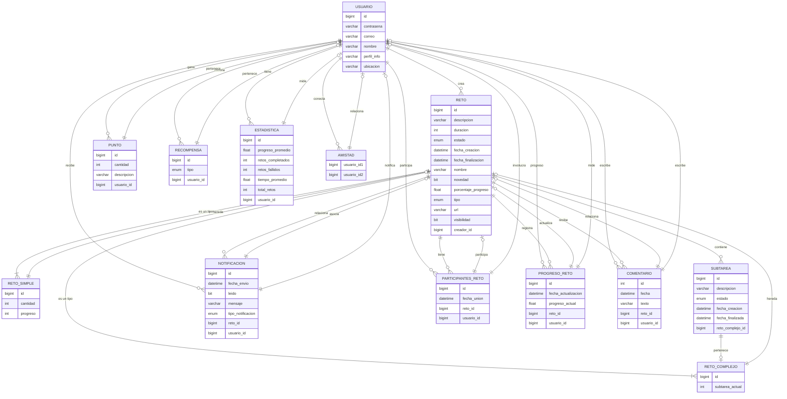

```mermaid
erDiagram
    
    USUARIO {
        bigint id
        varchar contrasena
        varchar correo
        varchar nombre
        varchar perfil_info
        varchar ubicacion
    }

    RETO {
        bigint id
        varchar descripcion
        int duracion
        enum estado
        datetime fecha_creacion
        datetime fecha_finalizacion
        varchar nombre
        bit novedad
        float porcentaje_progreso
        enum tipo
        varchar url
        bit visibilidad
        bigint creador_id
    }

    RETO_SIMPLE {
        bigint id
        int cantidad
        int progreso
    }

    RETO_COMPLEJO {
        bigint id
        int subtarea_actual
    }

    SUBTAREA {
        bigint id
        varchar descripcion
        enum estado
        datetime fecha_creacion
        datetime fecha_finalizada
        bigint reto_complejo_id
    }

    NOTIFICACION {
        bigint id
        datetime fecha_envio
        bit leido
        varchar mensaje
        enum tipo_notificacion
        bigint reto_id
        bigint usuario_id
    }

    PARTICIPANTES_RETO {
        bigint id
        datetime fecha_union
        bigint reto_id
        bigint usuario_id
    }

    PROGRESO_RETO {
        bigint id
        datetime fecha_actualizacion
        float progreso_actual
        bigint reto_id
        bigint usuario_id
    }

    PUNTO {
        bigint id
        int cantidad
        varchar descripcion
        bigint usuario_id
    }

    RECOMPENSA {
        bigint id
        enum tipo
        bigint usuario_id
    }

    ESTADISTICA {
        bigint id
        float progreso_promedio
        int retos_completados
        int retos_fallidos
        float tiempo_promedio
        int total_retos
        bigint usuario_id
    }

    COMENTARIO {
        int id
        datetime fecha
        varchar texto
        bigint reto_id
        bigint usuario_id
    }

    AMISTAD {
        bigint usuario_id1
        bigint usuario_id2
    }

    USUARIO ||--o{ RETO : "crea"
    USUARIO ||--o{ NOTIFICACION : "recibe"
    USUARIO ||--o{ PARTICIPANTES_RETO : "participa"
    USUARIO ||--o{ PROGRESO_RETO : "progreso"
    USUARIO ||--o{ PUNTO : "gana"
    USUARIO ||--o{ RECOMPENSA : "obtiene"
    USUARIO ||--o{ ESTADISTICA : "tiene"
    USUARIO ||--o{ COMENTARIO : "escribe"
    USUARIO ||--o{ AMISTAD : "conecta"

    RETO ||--|{ RETO_SIMPLE : "es un tipo"
    RETO ||--|{ RETO_COMPLEJO : "es un tipo"
    RETO ||--o{ SUBTAREA : "contiene"
    RETO ||--o{ NOTIFICACION : "relaciona"
    RETO ||--o{ PARTICIPANTES_RETO : "tiene"
    RETO ||--o{ PROGRESO_RETO : "registra"
    RETO ||--o{ COMENTARIO : "recibe"

    RETO_SIMPLE ||--o| RETO : "hereda"
    RETO_COMPLEJO ||--o| RETO : "hereda"

    SUBTAREA ||--|o RETO_COMPLEJO : "pertenece"
    NOTIFICACION ||--o| RETO : "asocia"
    NOTIFICACION ||--o| USUARIO : "notifica"
    PARTICIPANTES_RETO ||--o| RETO : "participa"
    PARTICIPANTES_RETO ||--o| USUARIO : "involucra"
    PROGRESO_RETO ||--o| RETO : "actualiza"
    PROGRESO_RETO ||--o| USUARIO : "mide"
    PUNTO ||--o| USUARIO : "pertenece"
    RECOMPENSA ||--o| USUARIO : "pertenece"
    ESTADISTICA ||--o| USUARIO : "mide"
    COMENTARIO ||--o| RETO : "relaciona"
    COMENTARIO ||--o| USUARIO : "escribe"
    AMISTAD ||--o| USUARIO : "relaciona"
```